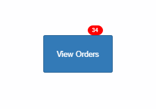

Bubbles
====

The Bubbles extender component __enhances all Wisej components__ by providing additional properties and a useful bubble notification functionality. Every widget can display a popup animated and themed bubble when a value changes

License
-------
 Copyright (C) ICE TEA GROUP LLC, All rights reserved.
