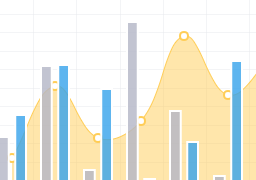

ChartJS
====

The ChartJS extension component uses the excellent ChartJS widget to render amazing charts in real time. Please note that this extension is still under development and some advanced options are not yet available. Nevertheless, it’s quite an extension!

Uses 3rd party JavaScript library [ChartJS](http://www.chartjs.org/)

## [Example application](https://github.com/iceteagroup/wisej-examples/tree/2.0/ChartJS)

## [Try it on Online](http://demo.wisej.com/ChartJS)

License
-------
 Copyright (C) ICE TEA GROUP LLC, All rights reserved.
