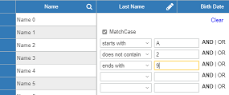

ColumnFilter
====

The ColumnFilter extender component allows you to add row filtering to your DataGridViews. It includes 2 ready made FilterPanels.

## ["How to" blog](https://wisej.com/blog/columnfilter/)

## [Example application](https://github.com/iceteagroup/wisej-examples/tree/2.0/ColumnFilter)

## [Try it on Online](http://demo.wisej.com/ColumnFilter)

License
-------
 Copyright (C) ICE TEA GROUP LLC, All rights reserved.
