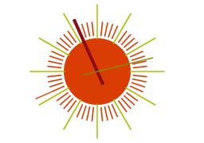

CoolClock
====

The CoolClock extension component uses the CoolClock widget to render amazing analog clocks as Wisej Real Time widgets. Supports several skins, logarithmic scale, and several properties to configure the tick delay or hide the second’s hand.

Uses 3rd party JavaScript library [CoolClock](http://randomibis.com/coolclock/)

## [Example application](https://github.com/iceteagroup/wisej-examples/tree/1.5/CodeProject)

## [Try it on Online](http://demo.wisej.com/CodeProject)

License
-------
 Copyright (C) ICE TEA GROUP LLC, All rights reserved.
