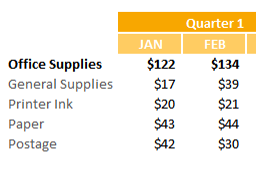

DataGridViewSummaryRow
====

Adds a new method to the DataGridView to automatically generate subtotal and summary rows using several different aggregation models.

To add the values in colSales, groupbed by the columns from colRegion to colCountry.

~~~
this.dataGridView1.AddSummaryRows(SummaryType.Sum, SummaryRowPosition.Above, this.colRegion, this.colCountry, this.colSales, style);
~~~

Call multiple times to aggregate different columns. It will add the subtotal to the same summary row that matches the group. You can created multiple parent summaries using SummaryRowPosition.Parent.

The method returns an array of DataGridViewSummaryRow rows that you can post process. You can also either pass a DataGridViewCellStyle to the AddSummaryRows method or assign it directly to the newly added rows.

License
-------
 Copyright (C) ICE TEA GROUP LLC, All rights reserved.
