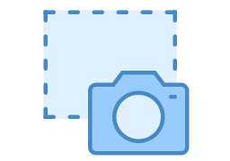

Html2Canvas
====

The Html2Canvas extension component uses the Html2Canvas library. This Wisej component that can take a screenshot of a specific control or the entire browser and send the image back to the server.

Uses 3rd party JavaScript library [html2canvas](https://html2canvas.hertzen.com/)

License
-------
 Copyright (C) ICE TEA GROUP LLC, All rights reserved.
