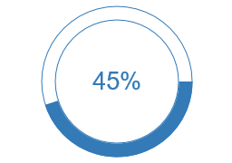

ProgressCircle
====

The ProgressCircle component is entirely implemented on the server side as a derived class of Wisej.Web.Canvas. It draws on a HTML5 canvas element on the client directly from the server in real time. The component lets you set value, line style and thickness, fill color, font, etc.

License
-------
 Copyright (C) ICE TEA GROUP LLC, All rights reserved.
