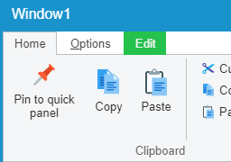

RibbonBar (V1)
====

The first release of the RibbonBar extension adds a new extension component to Wisej similar to the RibbonBar found in Windows applications. Requires Wisej 1.4.59+.

## [Example application](https://github.com/iceteagroup/wisej-examples/tree/1.5/RibbonBar)

License
-------
 Copyright (C) ICE TEA GROUP LLC, All rights reserved.
