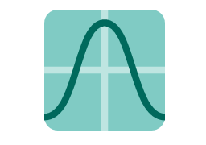

SmoothieChart
====

The SmoothieChart extension uses a cool JavaScript charting widget for streaming data in a scrolling chart.

Uses 3rd party JavaScript library [Smoothie Charts](http://smoothiecharts.org/) for charting streaming data

## [Example application](https://github.com/iceteagroup/wisej-examples/tree/1.5/SmoothieChartSample)

## [Try it on Online](http://demo.wisej.com/SmoothieChartSample)

License
-------
 Copyright (C) ICE TEA GROUP LLC, All rights reserved.
