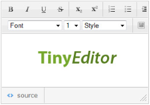

TinyEditor
====

The TinyEditor extension uses a simple, lightweight (under 9KB) and standalone JavaScript WYSIWYG editor. It handles most of the basic formatting and has some functionality built in to help keep the rendered markup as clean as possible.

Uses 3rd party JavaScript library [TinyEditor](https://github.com/jessegreathouse/TinyEditor)

## [Blog](https://wisej.com/blog/editors-choice/)

## [Example application](https://github.com/iceteagroup/wisej-examples/tree/2.0/EditorsChoice)

## [Try it on Online](http://demo.wisej.com/EditorsChoice)

License
-------
 Copyright (C) ICE TEA GROUP LLC, All rights reserved.
