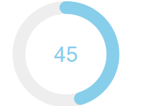

jQueryKnob
====

The jQueryKnob extension component uses the amazing jQueryKnob widget to create a Wisej Real Time dial control that allows the user to rotate the dial to change its value or to type the value in the middle editor. The component allows you to set the value, range, line style, colors and more.

Uses 3rd party JavaScript library [jQueryKnob](http://anthonyterrien.com/demo/knob/)

License
-------
 Copyright (C) ICE TEA GROUP LLC, All rights reserved.
